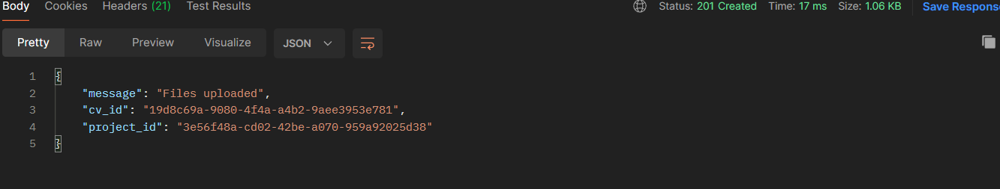
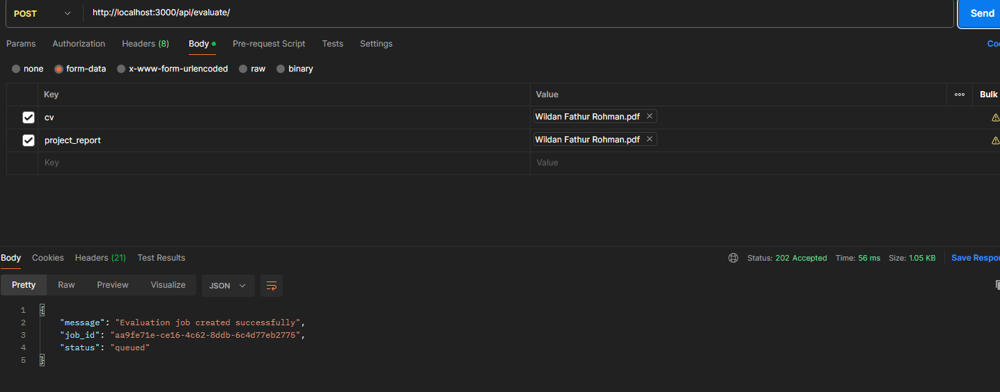
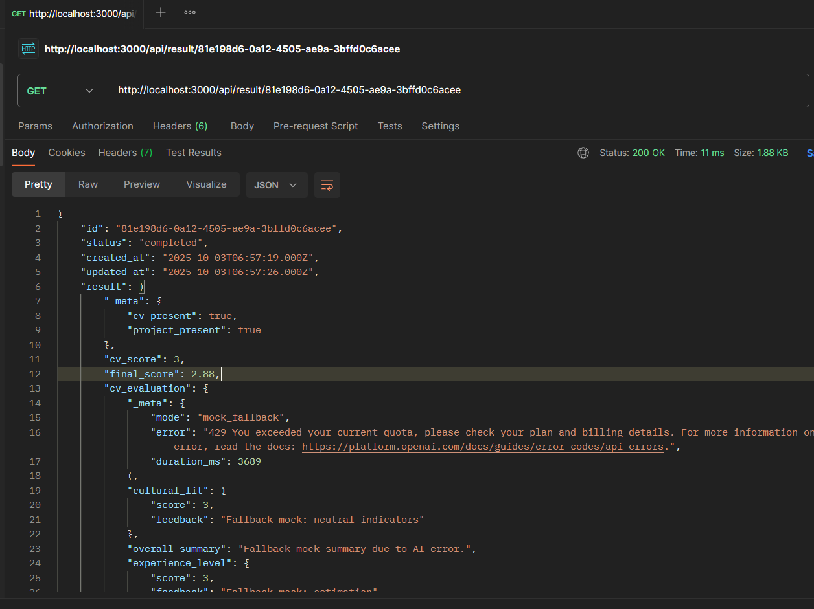

# AI CV Evaluator Submission

## 1. Title

AI CV Evaluator – Candidate CV & Project Report Scoring Backend

## 2. Candidate Information

Full Name: WILDAN FATHUR ROHMAN  
Email Address: fathurrohmanwildan136@gmail.com

## 3. Repository Link

Repo: https://github.com/wildanfr19/case-study-backend

## 4. Approach & Design

### 4.1 Ringkasan Implementasi

Alur utama: upload dokumen → job evaluasi async → evaluasi terpisah CV & Project dengan RAG → sintesis final → polling hasil.

### 4.2 Requirements Breakdown

| Requirement                 | Implementasi                                           |
| --------------------------- | ------------------------------------------------------ |
| Upload dua dokumen          | Endpoint `/api/upload` (kembali `cv_id`, `project_id`) |
| Evaluasi async              | Insert job → proses background → status polling        |
| RAG                         | Ingestion script + retrieval top-k chunk per kategori  |
| CV & Project scoring rubric | Bobot sesuai soal + hitung weighted                    |
| cv_match_rate (0–1)         | Weighted CV (1–5) × 0.2                                |
| project_score (1–5)         | Weighted project rubric                                |
| Final summary 3–5 kalimat   | LLM call ketiga + enforcement sentence constraint      |
| Retry/backoff               | Exponential retry pada AI call                         |
| Fallback/error resilience   | Mock mode, fallback per-komponen, synthetic result     |

### 4.3 Asumsi Utama

- Skala awal: single-process cukup.
- Ground-truth (job description, case brief, rubric) diingest ke store lokal.
- Fokus deterministik: temperature rendah (0.3–0.4).

### 4.4 System & Database Design

- Tabel `documents`: metadata file (id, type, path).
- Tabel `evaluations`: status job, path file, referensi document id, job title, JSON result.
- Status: queued → processing → completed|failed|canceled.
- Index di status & created_at untuk query cepat.

### 4.5 API Endpoints

```
POST /api/upload            # Dapatkan cv_id & project_id
POST /api/evaluate          # Terima cv_id, project_id, job_title (atau multipart legacy)
GET  /api/result/:id        # Poll hasil
GET  /api/evaluations       # List ringkas
POST /api/job/:id/cancel    # Batalkan job
```

OpenAPI: file `openapi.yaml`.

### 4.6 Long-Running Handling

- Non-blocking (202 Accepted)
- Background processing in-process
- Cancel memeriksa status & memutus eksekusi logis

### 4.7 LLM Integration & Chaining

1. CV Evaluation Prompt: injeksi context (job_description + rubric_cv top-k).
2. Project Evaluation Prompt: injeksi context (case_brief + rubric_project top-k).
3. Final Synthesis Prompt: gabungkan metrik intermediate → 3–5 kalimat ringkas.

### 4.8 RAG Strategy

- Chunking PDF (delimiter: double newline) + filtering panjang minimal
- Embedding fallback: hash vector lokal; otomatis pakai OpenAI embeddings bila tersedia
- Similarity: cosine top-k (k=3)
- Desain plug-and-play untuk vector DB eksternal

### 4.9 Prompting Strategy

- Format JSON ketat, parsing defensif (strip code fences, fallback regex)
- CV & Project prompts menginjeksikan chunk relevan terpisah
- Final synthesis prompt menggabungkan metrik + ringkas 3–5 kalimat

### 4.10 Scoring Computation

CV Weights: 40/25/20/15 (→ skor 1–5) → cv_match_rate = weighted × 0.2
Project Weights: 30/25/20/15/10 → project_score (1–5)
Tidak digabung; mengikuti format requirement.

### 4.11 Resilience & Error Handling

- Exponential retry (rate limit / transient network)
- Per-komponen fallback mock
- Synthetic result jika kedua evaluasi gagal
- Debug toggles (DEBUG_AI)
- Enforcement 3–5 kalimat

### 4.12 Edge Cases

| Edge Case                 | Penanganan                                         |
| ------------------------- | -------------------------------------------------- |
| File bukan PDF            | Ditolak oleh multer filter                         |
| Hanya 1 evaluasi gagal    | Partial success + issues[]                         |
| Keduanya gagal            | synthetic fallback (jika diaktifkan) atau failed   |
| Rate limit 429            | Retry lalu fallback                                |
| Dokumen kosong            | Skor tetap tetapi context retrieval mungkin kosong |
| Store retrieval kosong    | Tag `[NO_STORE]` tidak blokir evaluasi             |
| CV/Project sangat panjang | Truncation + flag truncated                        |

### 4.13 Security (Minimal)

- Helmet + rate limiting 60 req/menit.
- Belum ada auth / API key gating (bisa ditambah cepat jika diperlukan).

### 4.14 Observability

- Console logging dasar + debug flag
- Siap ditambah metrics/trace

## 5. Results & Reflection

### 5.1 Outcome

- Fungsionalitas utama dan fitur tambahan (cancel, fallback multi-lapis) berjalan.
- RAG sederhana tetapi plug-in untuk vector DB nyata tanpa ubah kontrak API.

### 5.2 What Worked Well

- Modular service layer memudahkan substitusi (misal ganti retrieval engine).
- Fallback & partial success menghindari kegagalan total.
- Enforce orientasi output memastikan stabilitas parsing.

### 5.3 What Didn’t Work / Limitations

- Retrieval masih hash embedding (akurasi semantik terbatas).
- Tidak ada distributed queue → single process bottleneck.
- Tidak ada validasi lanjutan terhadap hallucination di final summary.

### 5.4 Future Improvements

- Integrasi Qdrant/Chroma embeddings sebenarnya.
- Worker terpisah + Redis queue.
- Auth + multi-tenant isolation.
- Caching embedding & dedup chunk.
- Penilaian kualitas dengan self-critique pass.

### 5.5 Constraints

- API rate limit / quota (429) memaksa penggunaan fallback mock.
- Waktu implementasi → pilih hash embedding vs real vector store.

## 6. Screenshots / Sample Responses

Alur utama:

1. POST /api/upload → { cv_id, project_id }
2. POST /api/evaluate → { job_id, status: queued }
3. GET /api/result/:id (completed) → mencakup cv_match_rate, project_score

### 6.1 Screenshot Folder

Folder: `screenshoot/` (3 file)

```
screenshoot/
  01-upload.png
  02-evaluate.png
  03-result.png
```

Catatan: Penamaan folder menggunakan `screenshoot/` (dibiarkan apa adanya).

### 6.2 Screenshot API Flow

Upload Response:


Evaluate Response (Queued):


Result Completed (Ringkas):


> Hasil mencerminkan mode evaluasi dengan mock fallback bila quota membatasi.

### 6.3 Sample Result JSON (Ringkas)

### 6.4 Plain Text JSON Snippet

```json
{
  "id": "...",
  "status": "completed",
  "result": {
    "cv_match_rate": 0.74,
    "project_score": 3.9,
    "overall_summary": "... 3-5 sentences ..."
  }
}
```

## 7. Bonus Work

- Cancel job endpoint.
- Synthetic fallback multi-lapis.
- Retry + exponential backoff.
- Sentence constraint enforcement.
- OpenAPI spec.
- Basic tests (mock mode, retrieval, summary constraint).

## 8. Build Artifact

Dokumen ini dapat diekspor ke PDF (mis. pandoc / extension) tanpa modifikasi tambahan.

---

---

## 9. Submission Checklist

| Item                               | Status | Catatan                                           |
| ---------------------------------- | ------ | ------------------------------------------------- |
| Upload endpoint (`/api/upload`)    | ✔      | Mengembalikan `cv_id`, `project_id`               |
| Async evaluate (`/api/evaluate`)   | ✔      | Mendukung JSON (id) & multipart                   |
| Result polling (`/api/result/:id`) | ✔      | Status & hasil terstruktur                        |
| RAG retrieval (hash embedding)     | ✔      | Top-k chunk injeksi prompt                        |
| CV & Project rubric scoring        | ✔      | Weighted, output `cv_match_rate`, `project_score` |
| Final summary 3–5 kalimat          | ✔      | Enforcement + trimming/filler                     |
| Retry & fallback mock              | ✔      | Exponential backoff + flags                       |
| Partial success + issues[]         | ✔      | Jika salah satu evaluasi gagal                    |
| Synthetic fallback (kedua gagal)   | ✔      | Flag opsional aktifkan                            |
| Cancel job endpoint                | ✔      | `/api/job/:id/cancel`                             |
| OpenAPI spec                       | ✔      | File `openapi.yaml`                               |
| Basic tests (Jest)                 | ✔      | AI mock, retrieval, summary constraint            |
| Dockerized                         | ✔      | `Dockerfile`, `docker-compose.yml`                |
| Security baseline                  | ✔      | Helmet + rate limiting                            |
| Screenshots embedded               | ✔      | Lihat Section 6                                   |
| README & SUBMISSION.md             | ✔      | Dokumentasi lengkap                               |
